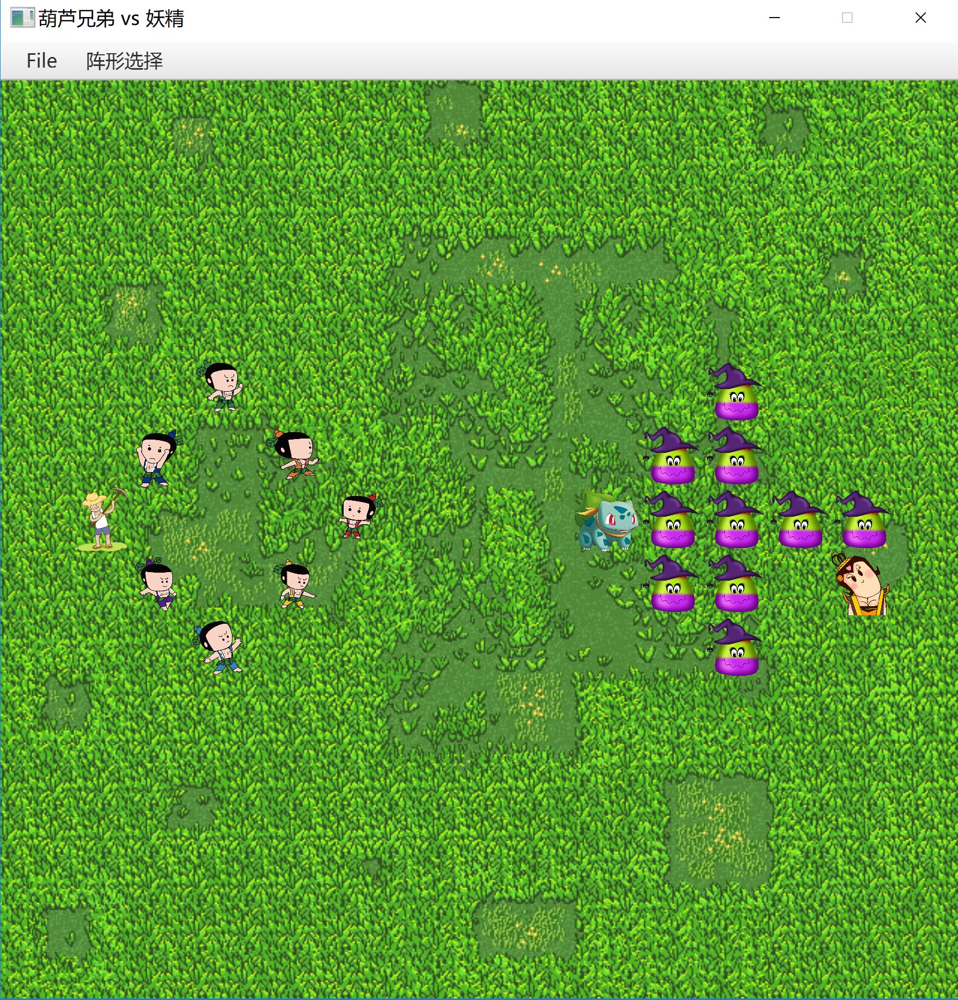
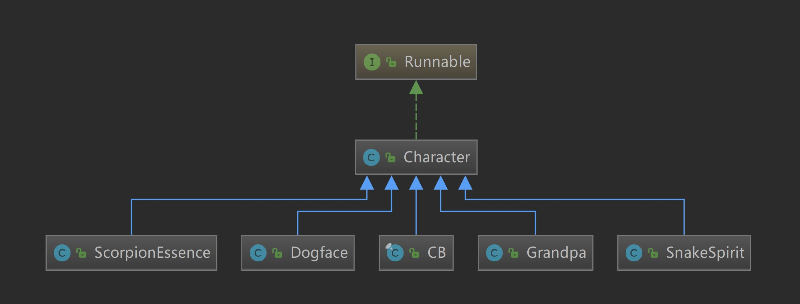
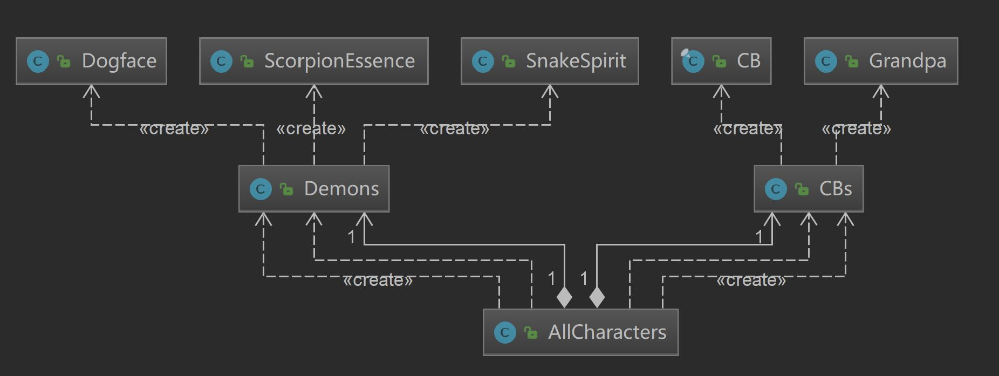

# *JAVA*程序设计大作业

> 南京大学计算机科学与技术系 Java程序设计课程大实验
>
> 161220105 施霄航

## 


## 

## 0.开发环境
* IDE : IntelliJ IDEA 2018.2
* java : jdk 10.0.2 
* Maven : 3.3.9

## 1.游戏玩法
* 15行 15列 二维空间
* 初始界面：七个葫芦娃和老爷爷以鹤翼阵型组成左侧战队（以下简称葫芦娃战队），
蝎子精、蛇精和十个小喽啰以鹤翼阵型组成右侧战队（以下简称妖精战队）
* *NORMAL*模式
  * 常规对战模式，正常打开应用即为该模式
  * 使用菜单栏上的**阵形选择**功能分别指定葫芦娃战队和妖精战队的初始阵型
  * 按空格键开始对战
  * 使用菜单栏上**File**里面的**Save Log**功能，将这盘游戏的战斗记录保存到你指定的位置（
  限定为xml文件）。如果你忘记保存，没关系，程序在关闭时会自动将战斗记录存储到src/main/java/replay目录下默认的default.xml文件中
  * 常规对战只能进行一次
* *REPLAY*模式
  * 战斗回放模式
  * 使用菜单栏上**File**里面的**Load Log*功能，将指定文件里面的战斗记录加载进来，然后按R建
  即可观看战队记录。支持一盘rep反复观看，再按R键可以再次观看，可以不断加载新的记录文件进来，加载
  完成后按R键就可以开始观看
  
## 2.游戏机制介绍
* 人物角色
  * 葫芦娃阵营
    * 葫芦娃 老大~老七 7人
    * 老爷爷 1人
  * 妖精阵营
    * 蝎子精 1人
    * 普通小喽啰 10人
    * 蛇精 1 人
* 对战方式
  * 以上述顺序，每人轮流执行一次操作，直到场上只剩一方人物，游戏结束
  * **一次操作**的定义：
    * 进行一次移动或者和目标敌方人物进行一次战斗
    * 移动操作包括移动1格和移动0格
  * 选择操作的机制：
    * 如果执行操作人物的临近格子(前后左右)有敌方人物，选择其中之一进行战斗，以某概率决定一方阵亡，另一方获胜继续留在战场
    * 否则，向离他最近的敌方人物方向移动一格，优先*X*方向移动，如果两个方向都有
    友方人物挡着，则不移动
    * 剩下的情形只能是敌方人物全部阵亡，此时游戏结束
  * 各战斗获胜概率
  
    |   |葫芦娃|老爷爷|蝎子精|小喽啰|蛇精|
    |:---:|:---:|:---:|:---:|:---:|:---:|
    |葫芦娃|   |   |0.3|0.65|0.45|
    |老爷爷|   |   |0.5|0.7|0.6|
    |蝎子精|0.75|0.55|   |   |   |
    |小喽啰|0.4|0.35|   |   |   |
    |蛇精|0.55|0.4|   |   |   |
    * 说明：从第二行开始每一行记录了进攻方对战各人物的获胜概率，每一人物作为进攻方和防守方的获胜概率不同，这是可以理解的
    
## 3.应用代码设计
### 1.代码结构
* src/main/java/enter里面放着应用的主体代码,分成六个包：Character,Factions,Gui,Map,Operations,Strategies
  * Gui 负责ui显示，所有内容最终的显示工作在这里完成
  * Characters 描述了游戏中所有的人物：
   他们都继承自Character类，Character类实现了Runnable接口，清晰明了。
  * Factions 中的类将游戏人物集中起来，CBs类将葫芦娃阵营的人物集中起来，Demons类将妖精阵营的人物集中起来
   。最终这两个类又集中于AllCharacters类中：
   
  * Map 描述了游戏地图，Positions类是整张图，Position是某一个点
   
  * Operations 描述了每一次操作，用来实现战斗回放功能
  * Strategies 描述了战队的初始阵型
  
* 另外 src/main/java/replay是默认保存战斗记录的地方,
src/main/resources 中存放了用来初始化图形界面的layout.fxml文件以及人物图片等资源，src/test/java中存放了测试类AppTest

### 2.关键机制的实现
#### 1.多线程并发
* 在我的应用中，每一个人物都要用到一个线程，刷新ui界面也要用到一个线程，它们之间是互斥的。我想要实现的线程并发效果是这样的，人物按顺序进行操作，每操作一次，就进行一次ui刷新，即人物线程1，刷新线程，人物线程2，刷新线程……为了实现多线程并发时，线程按照固定次序占用CPU，按要求终结，并且彼此对临界区资源互斥，我进行了以下设计：
    * 人物线程run方法  
  ```java
      @Override
      public void run() {
          try {
              while (!endflag.isEnd()) {
                  //首先判断是否有一方已经全部死亡
                  synchronized (lock) {
                      if (turn.getTurn() == runturn) {
                          if (this.getAlive()) {
                              int sx = x, sy = y;
                              int rs = tryMove();
                              if (rs == 0) {
                                  //找人战斗
                                  lastOp.setOpType(Operation.OpType.BATTLE);
                                  battle();
                              } else if (rs == 1) {
                                  //已经移动了
                                  lastOp.setOpType(Operation.OpType.MOVE);
                                  lastOp.setCharacter(this);
                                  opList.add(new Operation(Operation.OpType.MOVE,this));
                                  System.out.println(this.getName() + "：move from" + sx + "," + sy + "to" + x + "," + y);
                              } else if (rs == 2) {
                                  endflag.setEnd();//设置结束标志
                              }
                              turn.nextTurn();
                              lock.notifyAll();
                          } else {
                              System.out.println(this.getName() + "已死，无法活动！");
                              turn.nextTurn();
                              turn.nextTurn();
                              //跳过更新
                              lock.notifyAll();
                          }
                      } else {
                          //System.out.println(turn);
                          lock.wait();
                      }
                  }
              }
          } catch (InterruptedException e) { }
          System.out.println(this.getName()+"线程结束！");
      }
  ```
  * 刷新线程run方法
  ```java
  @Override
      public void run() {
          try {
              while (!endflag.isEnd()) {
                  synchronized (lock) {
                      if (turn.getTurn() % 2 == 1) {
  
                          //Thread.yield();//总是看看有没有其他线程在等待
                          Platform.runLater(() -> {
                              controller.updateLastOp();//更新葫芦娃
                          });
                          turn.nextTurn();
                          lock.notifyAll();
                          Thread.sleep(60);
  
  
                      } else {
                          lock.wait();
                      }
                  }
              }
  
          } catch (InterruptedException e) {
              System.out.println("InterruptedException!");
          }
  
          System.out.println("刷新线程结束！");
      }
  ```
  * 每一个线程中有一个while循环，进循环前先判断游戏是否结束，这是线程的终结条件
  * 进了循环就是同步块了，用synchronized(lock)来保证临界区资源互斥，lock是一个Object对象，在Main中实例化，通过某种方式传入所有的线程
  * 用一个Turn类的对象turn实现各个线程按次序占用CPU，在Main中实例化，传入各个线程，各个线程自身有独属于自己的runturn值。
    * 某一个线程获得lock的锁时，如果turn对应的次序和自身的runturn相同，就执行方法内容，并将turn对应的值+1模40取余，唤醒所有阻塞在lock上的线程，如果不同就阻塞在lock上。
    * turn的值决定了此刻将执行操作的线程，turn的值不断从0增长到39，各个线程设好各自的runturn值，就可以按规定顺序并发执行了
#### 2.异常处理: 
* 这次编程不可避免要处理异常，用try-catch-finally来处理,没有特别想说的
#### 3.集合类型
* 例子很多，比如存储各个人物线程用到了框架中的ArrayList
````java
private ArrayList<Character> allCBs;
private ArrayList<Character> allDemons;
```` 
#### 4.输入输出
* 读写战斗日志xml文件,截取片段
```java
public void outputBattlelog(File target) {
    try {
        DocumentBuilderFactory factory = DocumentBuilderFactory.newInstance();
        DocumentBuilder builder = factory.newDocumentBuilder();
        Document document = builder.newDocument();
        document.setXmlStandalone(true);
        Element replayInformation = document.createElement("ReplayInformation");
         ……
        TransformerFactory tff = TransformerFactory.newInstance();
         Transformer tf = tff.newTransformer();
        tf.setOutputProperty(OutputKeys.INDENT, "yes");
        tf.transform(new DOMSource(document), new StreamResult(target));
    }catch(Exception e){}
}

```

#### 5.单元测试
* 应用已经通过了针对于地图初始化 等信息的单元测试


                    
  

     

  
  


